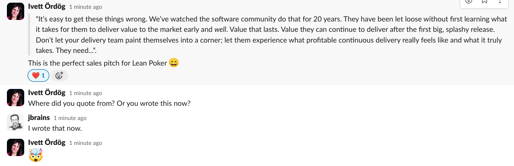
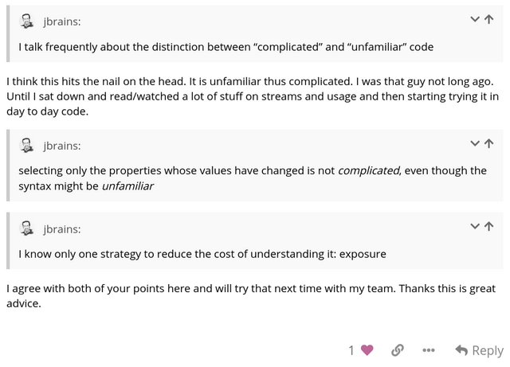

## Affordable personal mentoring and coaching

You need help, but you **can’t justify the expense of a full-time coach**. Maybe you’re not yet sure about buying one-on-one coaching sessions. You’re struggling to convince your employer to pay for the mentoring you need. **You need more** than what the world offers you for free, but your budget doesn’t have room for enterprise-level consulting. I would like to help you.

> “We (you and me) had one year of fruitful email conversations and I learned a lot from you and your courses. I think we accomplished a lot of the things we talked about in the beginning on how I can get better in software development and why I need to change a job: I got a new job, I leave my old company changed by your and my ideas and the situation is much better there than last year. My colleagues are still motivated to someday break through the management problems or work around them in a way, that the whole company benefits from it even more.” — M. S.

## Do any of these sound like you?

- I can get free advice from random people on the internet, but I don’t know whom to trust and most of what I read is just kinda OK. I can’t hang out on Lemmy all day! (or Quora. or Stack Overflow. or Hacker News.)
- I can read books, but I already have a backlog of 50 books that I’ll probably never get around to reading. I don’t know which books will help me, so I don’t know how to prioritize. And after I’ve read a great book that helps me, reading more in that topic area feels like it doesn’t give me much more.
- I have about 200 ideas for things to try, but I can’t decide where to start, I can’t do them all at once, and I’m worried that I’m going to choose the wrong thing!
- I have this learning allowance from my employer, but I need to use it for something more impactful than yet more books or training courses. (Does your employer place special constraints on how you spend your learning allowance? Tell me about your constraints and we can probably work something out that satisfies your employer.)
- I can talk to people at meetup groups and I learn some things from them, but I don’t feel comfortable just asking them outright for help. It feels like taking advantage of them.
- I can get help from my friends, but I worry that they generally won’t tell me what I need to hear.
- I want to do most of the learning on my own, but I don’t have the time or energy to just try everything to see what helps. I need some direction!

## How it works

In the space between Do It All Yourself and intensive 1-on-1 coaching lies The jbrains Experience. It works like this:

- You subscribe only as long as you need help, one month at a time.
- You ask questions to guide the conversation towards the topics that matter most to you right now!
- You join Office Hours sessions either by chat or by video conference. Participate openly or just lurk, whatever you’re in the mood for.
- You participate by chat when you want the feeling of “being there” and in a discussion forum when you prefer to think things through by writing.
- You purchase personal working sessions only if you need then and only once I’ve earned enough of your trust.

Part of the work we do in Office Hours Chat!, part of The jbrains Experience

BUTTON TO JOIN NOW

## What you get

- Access to a back-catalog of well over 200,000 words of questions and answers with topics about code, organizational dynamics, and people.
- Access to a private chat workspace: ask questions, get answers, chat with the other members of the group.
- The chance to have interesting and helpful discussions with other members of the group.
- The “Bat Phone”: rapid, direct access to me by email or private chat for especially sensitive questions.
- The option to purchase individual working sessions at more than 75% off the price that companies pay to hire me.
- Advance notice of special events and programs, such as group practice sessions and micro-training courses, and at discounted prices. (Sometimes free!)
- Cancel your subscription any time if you decide that you’ve got what you needed.

All subscriptions are monthly, so there’s **no pressure and no long-term commitment**: stay as long as it’s helping and leave when you’ve got what you needed!

> “We (you and me) had one year of fruitful email conversations and I learned a lot from you and your courses. I think we accomplished a lot of the things we talked about in the beginning on how I can get better in software development and why I need to change a job: I got a new job, I leave my old company changed by your and my ideas and the situation is much better there than last year. My colleagues are still motivated to someday break through the management problems or work around them in a way, that the whole company benefits from it even more.” — M. S.

JOIN NOW BuTTON

## What kind of help can you expect?

Here are some areas in which I have been helping people since the early 2000s:

- Evolutionary design: test-driven development, testing, incremental design, modular design… techniques for smoothing out the cost of adding features over time.
- Value-driven product development: deliberate discovery, exploring and refining product ideas, writing examples, communicating effectively among the people requesting features and those delivering them… techniques for investing more wisely in delivering products to markets
- Organizing personal work: tracking tasks, increasing focus, reducing stress, balancing responsiveness with completing tasks… techniques for achieving more and sustaining your energy while doing it.
- Interacting more harmoniously with others: understanding motivation, adapting your communication style to others, increasing empathy and compassion, improving resilience… techniques for interacting more harmoniously with other people, both on the job and at home.
- Navigating your career: leading without authority, playing the “company politics” game with integrity, reducing stress and avoiding burnout, reviewing architectural proposals or change program ideas.
Guiding groups to change how they work: coaching the coach, adopting new practices safely, running effective retrospectives… techniques for helping groups on path of continuous improvement.

An exchange in the Forum, part of The jbrains Experience

## Not only "Agile"

I’m known in some circles for being “an old XP dude”, for teaching TDD, and for generally leaning towards “Agile” ways of working. Even so, I don’t push Agile frameworks. I value feedback and simplicity, I recognize the power of habits, and I like to help people figure out when they need to increase capacity and when they need to reduce interference. No matter the topic, we spend most of our time talking about the nature of the problem, then potential solutions seem to present themselves to us.

> its amazing that you understand it [my situation and how I’m feeling about it] correctly and comprehensively — a comment during an Office Hours session

## Not only for programmers

Although programmers are still the largest group of software professionals who find me, we address issues that go far beyond writing code, cultivating design, and testing systems. I also help software professionals with other aspects of their work and indeed their lives away from their job.

- Managing personal finances and lifestyle design
- Becoming a freelancer
- Public speaking, writing, and other forms of presenting ideas
- Fundamentals of marketing and ethical selling

> I was stressing about non-business related personal finance issues. Your advice was that the business should be working for me or there’s really no point in having it. [After talking with you for an hour] I turned the corner and understood what I needed to do to make the business enjoyable and successful. — A. E.

Don’t worry! **I’m not a “life coach” and I’m definitely not a licensed therapist**. I commit firmly to avoid stepping over that line. Even so, I do my best to **create a space in which software professionals feel safe** about asking for the help they need.

Often I start working with clients by discussing software delivery techniques, but as we start addressing those issues, it becomes clear that we need to account for outside forces. This mostly means some combination of “other people” and “the stories I tell myself”. We start trying to split features into thin slices and we end up talking about the problem of the eternally impatient customer. We start trying to refactor code and we end up talking about the technical lead who refuses to write anything down. We start trying to write smaller tests and we end up talking about how hard it will be to justify this approach to their co-workers. I learned it from Jerry Weinberg: every problem eventually becomes a “people problem”. And remember that we are also people, so we are often part of the problem!

> [Your communication style and coaching approach] is most of the value that I’m getting from you. — A. 

BUY BUTTON

## A note to companies 

I offer this mentoring service to individuals, but companies also hire me for this style of incremental consulting at a distance. If you’re bigger than a “one-person show”, then please [read more about how to book a working session with me](https://book.jbrains.ca). This service is not suitable for me to mentor a team nor to do roving consulting for various teams within a larger organization. If you need a more comprehensive program than merely the occasional working session, then find out more at https://consulting.jbrains.ca.

If you’re an individual working in a larger organization, then please join us! If, over time, you decided that it would benefit the organization to engage me, then we would know enough by then to start designing a coaching program that fits your wider community.

BUY BUTTON